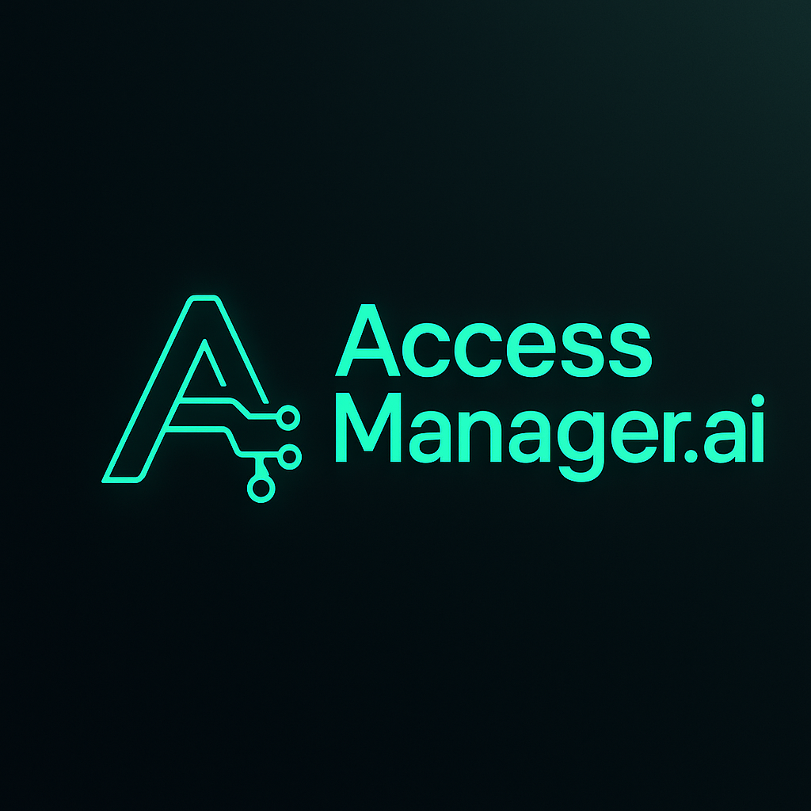

<p align="center">
  
</p>

# Access Manager (AccessManager.ai)
Sell Discord access your way — automate roles, upsells, and bundles.

## One-click Deploy (Render)
- Use `render.yaml` to create a **Blueprint** in Render. It will create:
  - `accessmanager-ai-backend` (Node/Express + SQLite)
  - `accessmanager-ai-frontend` (Vite static site)
- After deploy, set Whop webhook to: `https://<backend>/api/webhooks/whop`
- Put the same `WHOP_WEBHOOK_SECRET` into Whop → Developer → Webhooks and your backend env vars.

## Local dev
```
cd backend && npm install && npm run migrate && npm start
cd frontend && npm install && npm run dev
```

## Features
- Map Whop **products** ↔ Discord **roles**
- Whop webhook queues **grant/revoke** events
- Users link Discord; queued events process automatically
